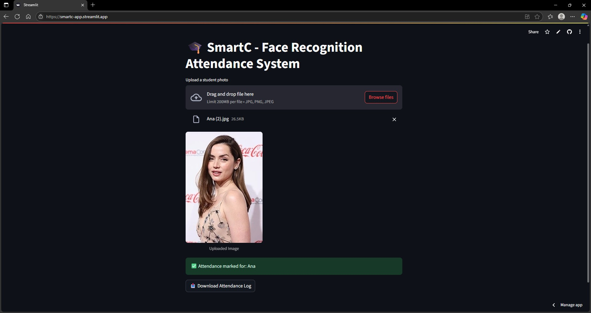

# 🎓 SmartC - Face Recognition Attendance System

SmartC is a simple and intuitive web application built using **Streamlit** and **face_recognition** to automate student attendance through face recognition.

## 🚀 Features

- ✅ Recognizes and matches faces against a directory of known students
- 📸 Upload a student's image and mark their attendance
- 📝 Attendance log saved as `attendance.csv`
- 📥 Download attendance records in CSV format
- 🧠 Uses `face_recognition` for accurate face encoding and comparison
- 💡 Fast and lightweight, suitable for small-scale or demo use

## 🖼️ Demo

  

---

## 📁 Folder Structure

```
SmartC-Streamlit/
│
├── app.py                                    # Main Streamlit application
├── known_faces/                              # Folder with known student images (.jpg/.png)
│   ├── Ana.jpg
│   ├── Angelina.jpg
│   ├── Robert.jpg
│   └── Sydney.jpg
├── dlib-20.0.0-cp311-cp311-linux_x86_64.whl  # Precompiled dlib wheel for Python 3.11
├── packages.txt                              # Optional extra packages (if used for deployment)
├── requirements.txt                          # Python dependencies
├── README.md                                 # Project overview and instructions
├── LICENSE                                   # BSD 3-Clause License file
└── assets/                                   # Folder containing demo screenshot
    └── demo-screenshot.jpg
```

---

## 📸 How It Works

1. Add images of known students to the `known_faces/` folder (filename = student name).
2. Run the Streamlit app:  
   ```bash
   streamlit run app.py
   ```
3. Upload a student's photo through the UI.
4. The system detects and matches the face, marks attendance, and logs the timestamp.
5. Download the attendance CSV via the download button.

---

## 🔧 Requirements

Install the required packages using pip:

```bash
pip install -r requirements.txt
```

> **Note**: On some systems, you may need to install `dlib` and `cmake` manually due to compilation dependencies.

---

## ✅ Sample Image Naming

Place student images in the `known_faces` folder using the format:

```
known_faces/
├── John_Doe.jpg
├── Alice_Wonder.png
```

These filenames will be used as names in the attendance log.

---

## 📦 Output

When a match is found, the app will:

- ✅ Display success message with the student's name
- 🕒 Append a new row to `attendance.csv` with name and timestamp
- 📥 Offer a download link for the log

Sample `attendance.csv`:
```
John_Doe,2025-07-03 11:45:23
Alice_Wonder,2025-07-03 11:48:10
```

---

## 🙋‍♂️ Acknowledgements

- [face_recognition](https://github.com/ageitgey/face_recognition) by @ageitgey
- [Streamlit](https://streamlit.io/) for making interactive Python apps effortless

---

## 🛠️ Future Improvements

- Live webcam attendance (via OpenCV)
- Duplicate prevention for same-day entries
- Role-based user access
- Cloud storage integration (Google Drive/Sheets)

---

## 📬 Contact

For any queries or suggestions:  
**Alvin Regin** – [LinkedIn](https://www.linkedin.com/in/alvin-regin-3065b722b/) | [GitHub](https://github.com/alvinregin)

---

## 📝 License

This project is licensed under the BSD 3-Clause License - see the [LICENSE](LICENSE) file for details.
